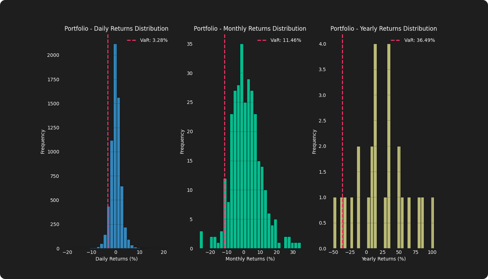
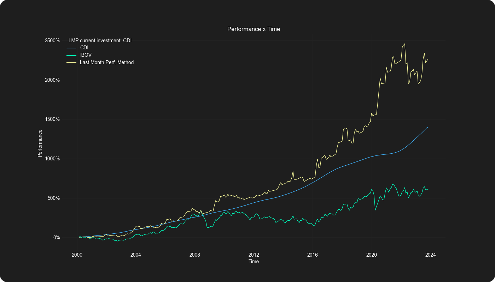
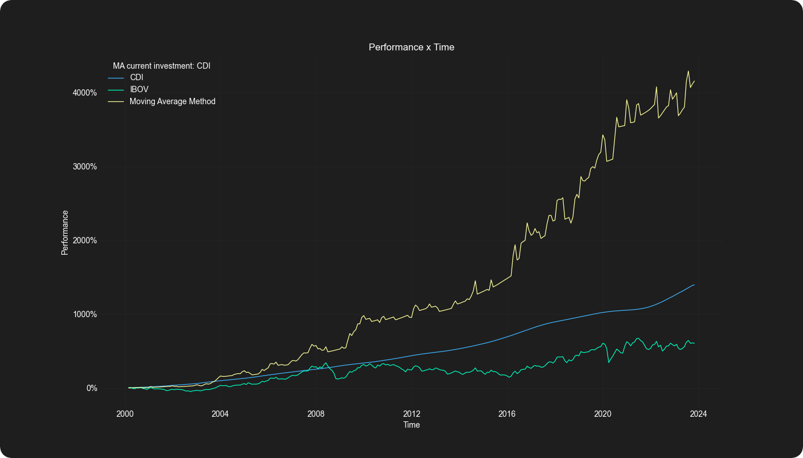
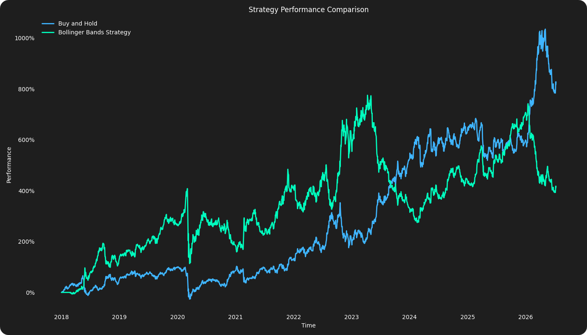

# 📈 Financial Market Python

A Python toolkit for quantitative strategy research, portfolio analysis, risk measurement, and market data.

## Installation

The project requires Python 3.12 or 3.13 and [uv](https://docs.astral.sh/uv/).

```bash
git clone https://github.com/gabrielpalassi/FinancialMarketPython.git
cd FinancialMarketPython
uv sync
```

Start the interactive menu:

```bash
uv run main.py
```

## Available Tools

### Portfolio Analysis

#### Portfolio Backtest

Backtests a user-defined weighted portfolio and compares its cumulative return with its individual assets.


#### Markowitz Portfolio Optimization

Builds an efficient frontier and solves for maximum-Sharpe, target-return, or target-risk portfolios using annualized historical returns and covariance.


#### Drawdown Analysis

Calculates drawdown series and maximum historical drawdown for individual assets or a weighted portfolio.


#### Historical Value at Risk

Estimates historical VaR for assets or a portfolio at daily, monthly, and annual frequencies using a configurable confidence level.



### Market Data

#### Brazilian Central Bank Historical Data

Retrieves and visualizes SELIC, USD/BRL, EUR/BRL, IPCA, and IGP-M data from Banco Central do Brasil.


#### Brazilian Central Bank Market Expectations

Retrieves the latest FOCUS survey expectations for SELIC, exchange rates, IPCA, and IGP-M.


### Strategies

#### Relative Momentum Allocation

Allocates to IBOV after it outperforms CDI during the previous month; otherwise, it allocates to CDI.



#### Moving Average Allocation

Allocates to IBOV when its monthly closing price is above its moving average; otherwise, it allocates to CDI.



#### Bollinger Bands Mean Reversion

Maintains a long position below the lower band and a short position above the upper band. The window, standard-deviation multiplier, and transaction costs are configurable.



## Research Model

The reusable strategy workflow is:

1. Load and align market data.
2. Generate a desired position or allocation signal.
3. Shift the signal by one period before applying returns.
4. Calculate turnover and subtract transaction costs.
5. Build strategy and benchmark equity curves.
6. Calculate a standardized set of performance metrics.

For example:

```python
from strategies.bollinger import bollinger_signals
from strategies.utils import performance_metrics, run_backtest

signals = bollinger_signals(prices, window=20, std_dev=2.0)
result = run_backtest(
    prices,
    signals["Signal"],
    transaction_cost_bps=10,
)

print(performance_metrics(result.strategy_returns))
```

## Project Structure

```text
.
├── main.py
├── src/
│   ├── market_data/
│   │   ├── bcb_historical_data.py
│   │   ├── bcb_market_expectations.py
│   │   └── utils.py
│   ├── portfolio_analysis/
│   │   ├── portfolio_backtest.py
│   │   ├── markowitz_optimization.py
│   │   ├── drawdown.py
│   │   ├── value_at_risk.py
│   │   └── utils.py
│   ├── strategies/
│   │   ├── relative_momentum.py
│   │   ├── moving_average.py
│   │   ├── bollinger.py
│   │   └── utils.py
│   └── utils.py
└── docs/images/
```

Each executable module exposes a guarded `main()` function, so modules can be imported without starting an interactive workflow.

## Data Sources

- [Yahoo Finance](https://finance.yahoo.com/) through `yfinance`
- [Banco Central do Brasil](https://www.bcb.gov.br/) through `python-bcb`

Downloaded market data may contain missing observations, revisions, ticker changes, or provider-specific adjustments. Results should be validated before being used in investment decisions.

## Current Scope

This repository is an educational quantitative research toolkit, not a live trading or order-execution system. Current backtests do not model bid-ask spreads, market impact, borrow availability, taxes, or intraday execution. Historical performance does not imply future results.

## Contributing

Contributions are welcome, particularly for additional strategies, risk metrics, data validation, walk-forward testing, and portfolio optimization methods.

## License

Licensed under the GNU General Public License v3.0 or later. See [LICENSE](./LICENSE).
